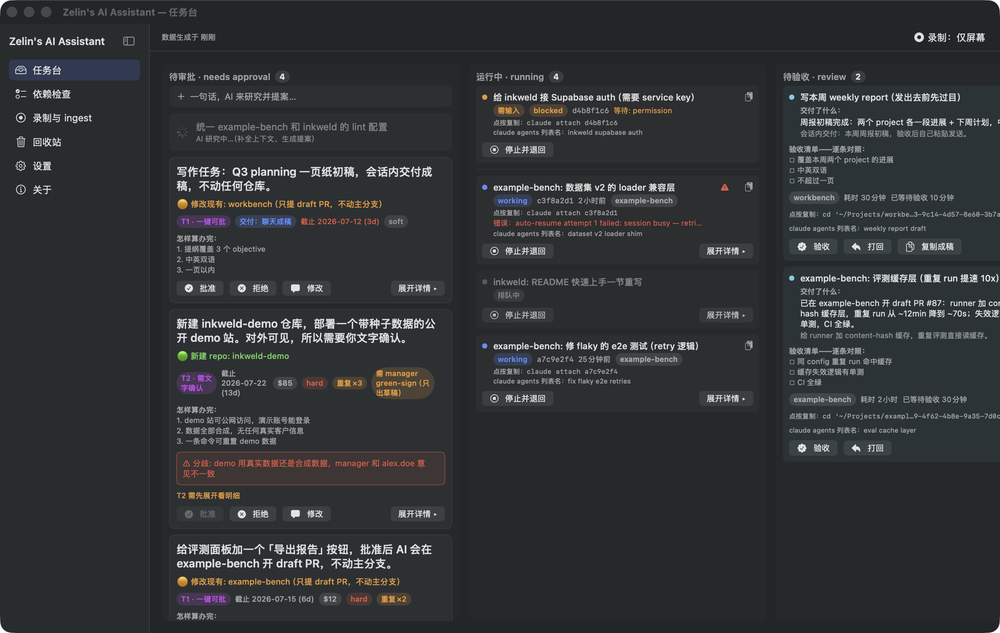
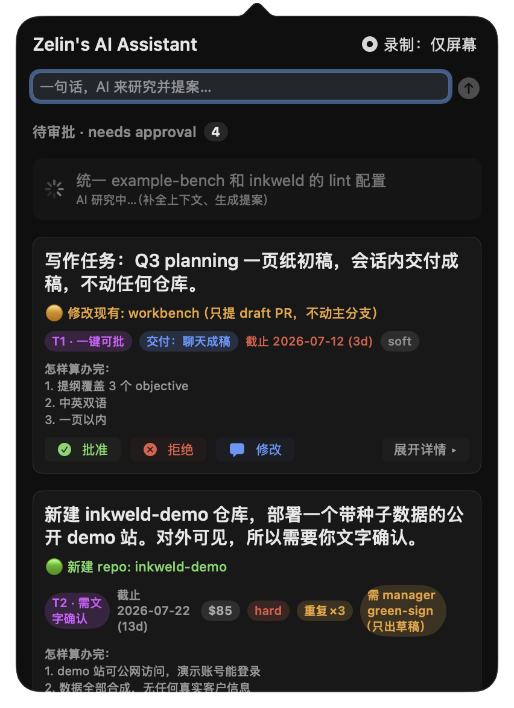
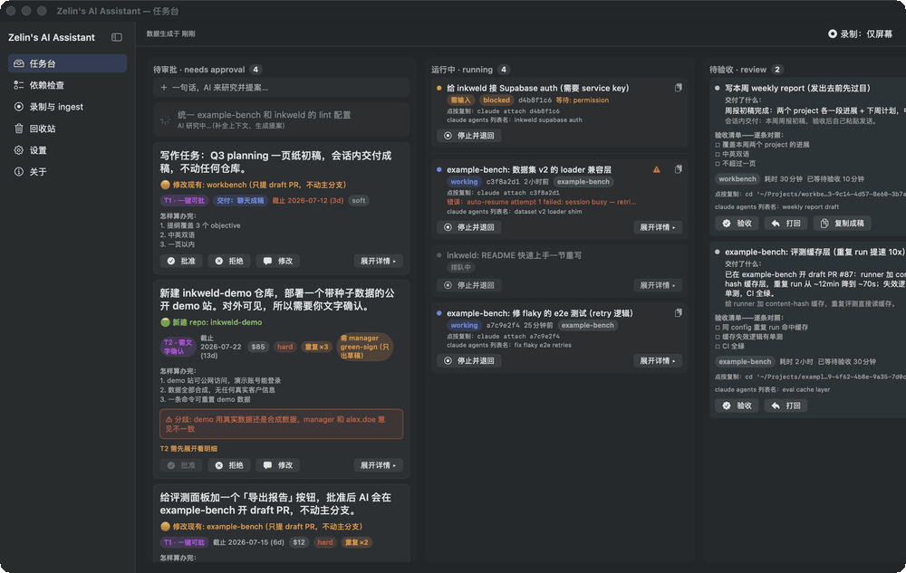
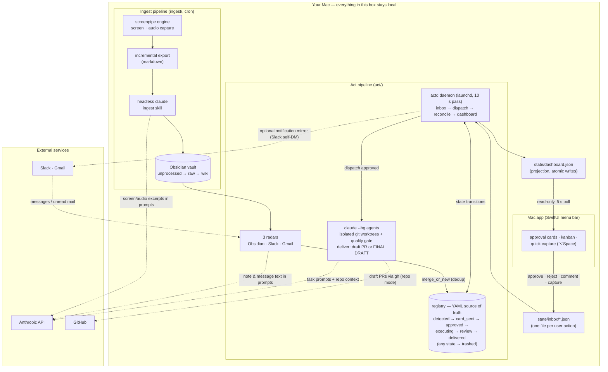

# Zelin's AI Assistant

**English** | [简体中文](README.zh-CN.md)

[](https://github.com/Wan-ZL/zelin-ai-assistant/actions/workflows/ci.yml)
[](https://github.com/Wan-ZL/zelin-ai-assistant/releases/latest)
[](LICENSE.md)
[](docs/INSTALL.md)
[](docs/INSTALL.md)

A personal AI chief-of-staff for macOS. It watches where work arrives (meeting notes, Slack, Gmail), turns requests into approval cards in your menu bar, and executes approved tasks with background Claude agents. You do two things — **approve** and **accept**. Everything else is automated.



<table><tr>
<td width="38%" valign="top"></td>
<td valign="top"><br><sub>The life of one card: approve → queued → executing → review → accepted (<a href="docs/assets/demo.mp4">mp4 version</a>; all data shown is fictional, generated by <code>scripts/demo_seed.py</code>)</sub></td>
</tr></table>

## How it works

- **Capture** — [screenpipe](https://github.com/mediar-ai/screenpipe) records screen + audio locally; scheduled jobs export increments and a headless Claude session distills them into an Obsidian wiki (`ingest/`).
- **Detect** — three radars (Obsidian notes, Slack, Gmail) scan for things people are asking you to do and file them into a YAML requirement registry that merges duplicates across sources (`act/`).
- **Approve** — each requirement becomes a proposal card (plain-language summary, cost estimate, acceptance criteria) in a SwiftUI menu-bar app. One click: ✅ approve, ❌ reject, 💬 comment.
- **Execute** — approved cards dispatch `claude --bg` agents in isolated git worktrees, supervised by a resident daemon (`actd`) with automatic resume and a quality gate (self-check, fresh-context diff review, draft-PR-only delivery).
- **Deliver** — finished work lands in a review lane: a paste-ready final draft for writing tasks, a draft PR for code. You accept it or send it back with comments.

The app and the pipeline are fully decoupled: the app only reads `state/dashboard.json` and writes your actions to `state/inbox/`. That two-file contract lives in [docs/CONTRACT.md](docs/CONTRACT.md).

### Architecture



Solid arrows are local file/process flow; dashed arrows are the only network egress (the full inventory, with the switches that control each one, is in [docs/PRIVACY.md](docs/PRIVACY.md)). The app never talks to the network and never touches the registry, secrets, or `claude` — its whole world is one readable file and one writable directory.

## Quickstart

```bash
git clone https://github.com/Wan-ZL/zelin-ai-assistant ~/Projects/zelin-ai-assistant
cd ~/Projects/zelin-ai-assistant
cp config.example.yaml config.yaml   # edit: Obsidian vault path, watched people, Slack IDs
bash install.sh                      # dependency checks → builds the app → launchd agents + cron chain
```

Then open the menu-bar app's Settings and paste your Anthropic API key (headless `claude` under cron/launchd cannot read Keychain OAuth, so the key lives in a `0600` file under `config/secrets/`).

- Full walkthrough with per-step checkpoints, exact TCC permission paths, and a "first card in 5 minutes" exercise: **[docs/INSTALL.md](docs/INSTALL.md)** (also covers the `.pkg` installer route).
- No API key yet? Preview the full UI with fictional data: `python3 scripts/demo_seed.py /tmp/assistant-demo` — see [docs/DEMO.md](docs/DEMO.md).

## Requirements

| Component | Version | Used for |
|---|---|---|
| macOS | 14+ | menu-bar app, launchd/cron scheduling, TCC permissions |
| Xcode / Swift toolchain | 6.x | building the app from source |
| [Claude Code CLI](https://claude.com/claude-code) + Anthropic API key | latest | radars, proposal expansion, and execution all run on headless `claude` |
| Python | 3.9+ with PyYAML | `actd` daemon, radars, digest |
| Node.js | LTS (`npx`) | the screen-capture engine runs via `npx screenpipe` — no separate install |
| Obsidian *(optional)* | — | radar scan source and wiki destination |
| `gh` CLI *(optional)* | — | draft-PR delivery |

## Features

- **Requirement radars with dedup** — restatements merge into the existing card instead of spamming you; genuine increments become linked "improvement" cards; low-confidence items park in a debt lane until raised.
- **Tiered approvals** — T0 auto / T1 one-click / T2 typed confirmation. Outbound messages, merges, and resource deletion are never automatic. Cost is shown above $5; above $50 the card escalates to T2.
- **Quality gate** — runnable check, read-only tests, fresh-context diff review, risk tiering, and revertible draft-PR delivery.
- **Two delivery modes** — `repo` (feature branch / draft PR) for code; `chat` (a paste-ready `FINAL DRAFT`) for writing tasks, so a one-paragraph reply never forces a git branch.
- **Quick capture** — press ⌥Space anywhere, type a thought; an LLM triages it against the registry: new card, related to an existing one, or ignore. <!-- screenshot slot: docs/assets/t2-card.png -->
- **Responsive UI** — every click gives feedback within one frame (optimistic echo), kanban main window, recycle bin with inverse operations instead of a fake undo, bilingual UI (English / 中文). <!-- screenshot slot: docs/assets/review-final-draft.png -->
- **Phone companion via iMessage or Slack** — approve/reject/accept cards, quick-capture thoughts, and 👍-tapback approvals from your iPhone using the iMessage "message yourself" thread (`phone_channel: imessage`, no third-party account needed — [docs/IMESSAGE_SETUP.md](docs/IMESSAGE_SETUP.md)); a Slack self-DM channel is available too.
- **Local-first state** — the registry, dashboard, and analytics stay on your Mac; telemetry is opt-in and off by default ([docs/TELEMETRY.md](docs/TELEMETRY.md)).

## Privacy & security

This tool records your screen, can read your Slack/Gmail, and runs unattended agents — read what leaves your machine, when, and which switches control it in [docs/PRIVACY.md](docs/PRIVACY.md). Sensitive apps are excluded from screen capture at the engine level (`recording.ignored_apps` in config.yaml — password managers, Keychain Access, and private-browsing windows by default; add your banking apps there). Report vulnerabilities privately via [SECURITY.md](SECURITY.md).

## Status

- [x] v0: approval card → ✅ → executed task, end to end
- [x] v1: three radars on cron/launchd, approval round-trip, Monday digest
- [x] v2: SwiftUI menu-bar app (popover + kanban window + quick capture + recycle bin + bilingual)
- [ ] v3: iOS remote approver (`ios/` is a placeholder)

What's in flight and what comes next: [docs/ROADMAP.md](docs/ROADMAP.md).

## Contributing

You don't need the full stack to hack on this: the test suite runs in under a second with just Python + PyYAML, and `scripts/demo_seed.py` drives the complete UI with fictional data — no API key, screenpipe, or Obsidian required. Start with [CONTRIBUTING.md](CONTRIBUTING.md); the [CODE_OF_CONDUCT.md](CODE_OF_CONDUCT.md) applies everywhere.

Questions → [Discussions (Q&A)](https://github.com/Wan-ZL/zelin-ai-assistant/discussions) · bugs → [issue forms](https://github.com/Wan-ZL/zelin-ai-assistant/issues/new/choose).

## License

Released under the [Functional Source License 1.1, MIT Future License (FSL-1.1-MIT)](LICENSE.md). In plain English:

- **You can** use, fork, modify, and redistribute it — including commercial use inside your company.
- **You can't** sell a product or service that competes with this software.
- **Future open source**: each release automatically converts to the MIT License 2 years after it ships.
- **Contributions** are welcome — issues, suggestions, and PRs alike; see [CONTRIBUTING.md](CONTRIBUTING.md). (GitHub shows the license as "Other" because FSL isn't in its detector; the badge above is authoritative.)

More questions — use at work, forks, what counts as competing use, per-release MIT conversion dates — are answered in plain language in [docs/LICENSE-FAQ.md](docs/LICENSE-FAQ.md).

## Documentation

| Doc | What's inside |
|---|---|
| [docs/INSTALL.md](docs/INSTALL.md) | the authoritative install guide: prerequisites, per-step checkpoints, TCC paths, first card in 5 minutes |
| [HANDOFF.md](HANDOFF.md) | **the handoff book, written by the AI assistant that built this system**: architecture map, the reasoning behind every "weird" design decision, and a pitfall list paid for in real debugging time |
| [docs/CONTRACT.md](docs/CONTRACT.md) | the `dashboard.json` / inbox data contract — change fields here first |
| [docs/TROUBLESHOOTING.md](docs/TROUBLESHOOTING.md) | symptom-first fixes for the known failure modes |
| [docs/DEMO.md](docs/DEMO.md) | demo mode (fictional data, no keys needed) and recording guide |
| [docs/PRIVACY.md](docs/PRIVACY.md) / [SECURITY.md](SECURITY.md) | data egress inventory / vulnerability reporting |
| [docs/ROADMAP.md](docs/ROADMAP.md) | what's in progress, next, and later |
| [CHANGELOG.md](CHANGELOG.md) | human-readable release history |
| [CONTRIBUTING.md](CONTRIBUTING.md) / [CODE_OF_CONDUCT.md](CODE_OF_CONDUCT.md) | how to contribute / community standards |
| [docs/LICENSE-FAQ.md](docs/LICENSE-FAQ.md) | FSL-1.1-MIT in practice: company use, competing use, the 2-year MIT conversion |
| [docs/SLACK_SETUP.md](docs/SLACK_SETUP.md) / [docs/GMAIL_SETUP.md](docs/GMAIL_SETUP.md) | optional source integrations |
| [docs/SANITIZATION.md](docs/SANITIZATION.md) | provenance: how this public export was sanitized from the private repo |

Internal design docs (`docs/design/`) contain real work details and are excluded from this export; a note remains in place.

### Repository layout

```
ingest/            # screenpipe → Obsidian chain (export / process / cleanup + skill)
act/
  actd.py          # daemon: inbox → dispatch → reconcile → dashboard
  executor.py      # claude --bg dispatch + resume/rework + quality gate + delivery harvest
  radar*.py        # three requirement radars (Obsidian / Slack / Gmail)
  analyze.py       # debt → approvable proposal expansion (LLM)
  digest.py        # Monday digest + self-improvement suggestion cards
  lib/             # config / registry (state machine) / dashboard projection / notify / secrets / …
  registry/        # requirement ledger (one YAML per requirement, generated at runtime)
  launchd/         # actd + radar plists
mac/               # SwiftUI menu-bar app (reads dashboard.json, writes inbox, never touches secrets)
ios/               # v3: remote approver (placeholder)
```

Copyright (c) 2026 Zelin Wan (https://github.com/Wan-ZL)
