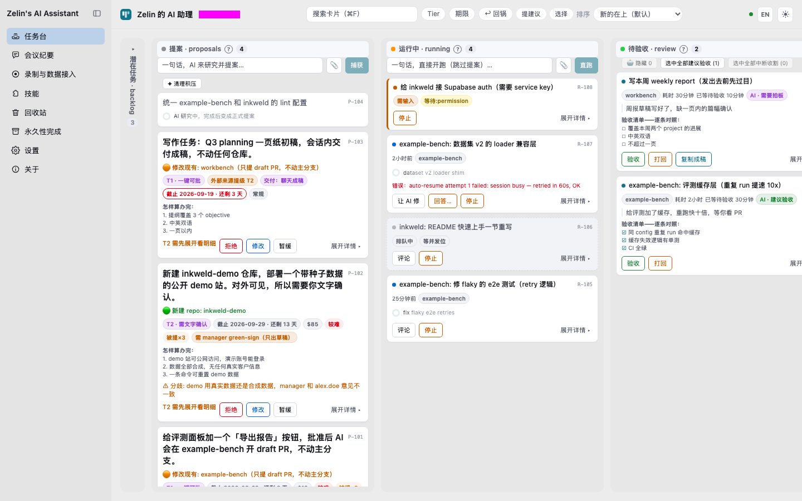
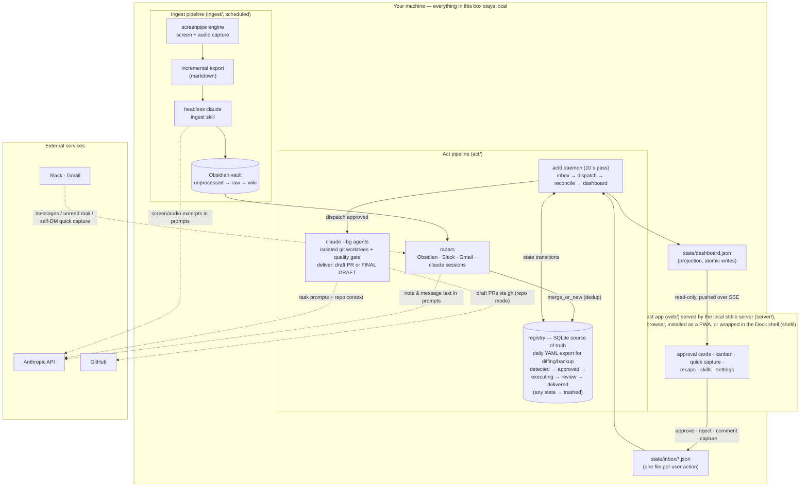
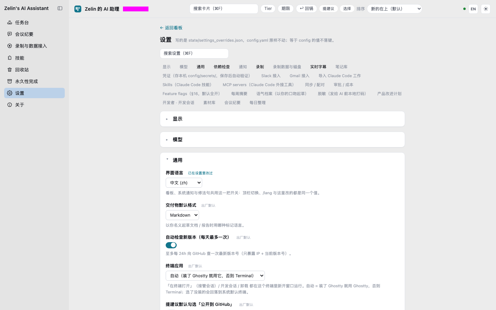
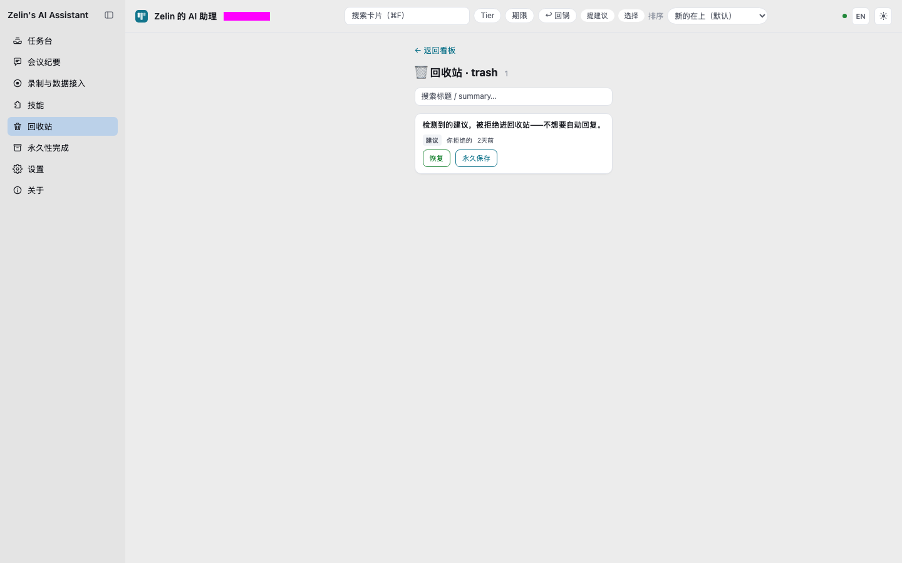
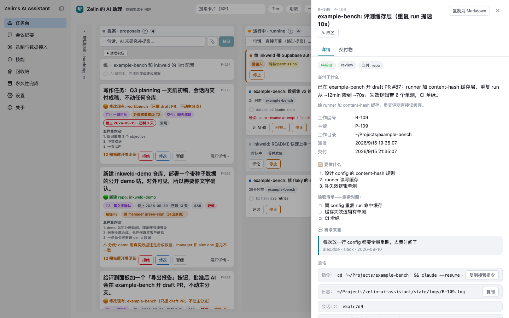
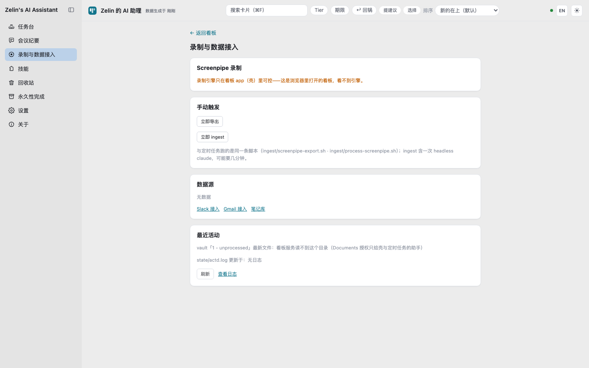
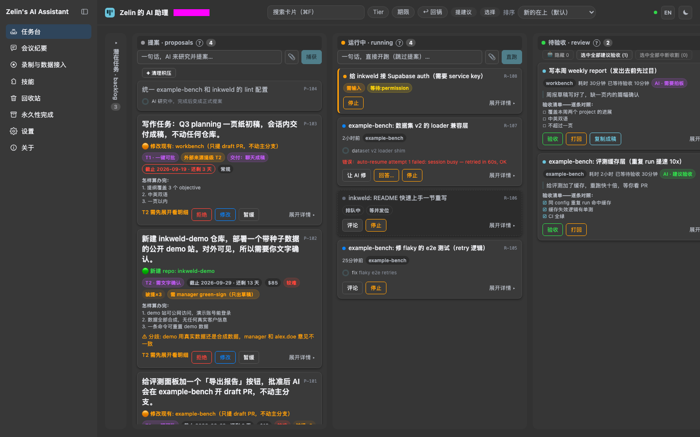

# Zelin's AI Assistant

**English** | [简体中文](README.zh-CN.md)

[](https://github.com/Wan-ZL/zelin-ai-assistant/actions/workflows/ci.yml)
[](https://github.com/Wan-ZL/zelin-ai-assistant/releases/latest)
[](LICENSE.md)
[](docs/INSTALL.md)
[](docs/INSTALL.md)

A personal AI chief-of-staff for macOS (and a headless-plus-board port on Windows and Linux). It watches where work arrives — meeting recordings, Slack, Gmail — turns requests into approval cards on a kanban board, and executes the approved ones with background Claude agents. You do two things: **approve** and **accept**. Everything else is automated.

This page describes **v1.0.114**. The version truth is the git tag on `main` (releases are minted on merge); `python3 scripts/version_stamp.py` prints the version of the checkout in front of you.



<p align="center"><sub>Every screenshot on this page is a real render of this release, captured by the <code>visual-goldens</code> workflow from the fictional demo data in <code>scripts/demo_seed.py</code> — no real person, message or repository appears in them. The capture runs in 中文; one switch in the header turns the whole board to English.</sub></p>

## How it works

- **Capture** — [screenpipe](https://github.com/mediar-ai/screenpipe) records screen and audio locally; scheduled jobs export increments and a headless Claude session distills them into an Obsidian wiki (`ingest/`).
- **Detect** — radars (Obsidian notes, Slack, Gmail, your own Claude sessions) scan for things people are asking you to do and file them into a requirement registry — a SQLite source of truth with a daily, diffable YAML export — merging duplicates across sources (`act/`).
- **Approve** — each requirement becomes a card in the backlog lane with a plain-language summary, a cost estimate and acceptance criteria. One click approves, rejects or comments.
- **Execute** — approved cards dispatch `claude --bg` agents in isolated git worktrees, supervised by a resident daemon (`act/actd.py`) with automatic resume and a quality gate: self-check, fresh-context diff review, draft-PR-only delivery.
- **Deliver** — finished work lands in the review lane: a paste-ready final draft for writing tasks, a draft PR for code. You accept it or send it back with comments.

The board and the pipeline are decoupled: the board reads the `state/dashboard.json` projection and writes your actions to `state/inbox/`; the daemon is the registry's only writer. That contract lives in [docs/CONTRACT.md](docs/CONTRACT.md).

### Architecture


```mermaid
flowchart TB
    subgraph MAC["Your machine — everything in this box stays local"]
        direction TB

        subgraph INGEST["Ingest pipeline (ingest/, scheduled)"]
            SP["screenpipe engine<br/>screen + audio capture"] --> EXP["incremental export<br/>(markdown)"]
            EXP --> DISTILL["headless claude<br/>ingest skill"]
            DISTILL --> VAULT[("Obsidian vault<br/>unprocessed → raw → wiki")]
        end

        subgraph ACTP["Act pipeline (act/)"]
            RADARS["radars<br/>Obsidian · Slack · Gmail · claude sessions"]
            REG[("registry — SQLite source of truth<br/>daily YAML export for diffing/backup<br/>detected → approved →<br/>executing → review → delivered<br/>(any state → trashed)")]
            ACTD["actd daemon (10 s pass)<br/>inbox → dispatch → reconcile → dashboard"]
            AGENTS["claude --bg agents<br/>isolated git worktrees + quality gate<br/>deliver: draft PR or FINAL DRAFT"]
            RADARS -->|"merge_or_new (dedup)"| REG
            ACTD <-->|"state transitions"| REG
            ACTD -->|"dispatch approved"| AGENTS
        end

        VAULT --> RADARS

        DASH["state/dashboard.json<br/>(projection, atomic writes)"]
        INBOX["state/inbox/*.json<br/>(one file per user action)"]

        subgraph APP["Board — React app (web/) served by the local stdlib server (server/),<br/>opened in a browser, installed as a PWA, or wrapped in the Dock shell (shell/)"]
            UI["approval cards · kanban · quick capture ·<br/>recaps · skills · settings"]
        end

        ACTD --> DASH
        DASH -->|"read-only, pushed over SSE"| UI
        UI -->|"approve · reject · comment · capture"| INBOX
        INBOX --> ACTD
    end

    subgraph EXT["External services"]
        ANTH["Anthropic API"]
        GH["GitHub"]
        SRC["Slack · Gmail"]
    end

    DISTILL -.->|"screen/audio excerpts in prompts"| ANTH
    RADARS -.->|"note & message text in prompts"| ANTH
    AGENTS -.->|"task prompts + repo context"| ANTH
    AGENTS -.->|"draft PRs via gh (repo mode)"| GH
    SRC -.->|"messages / unread mail / self-DM quick capture"| RADARS
```

Solid arrows are local file and process flow; dashed arrows are the only network egress — the full inventory, with the switch that controls each one, is in [docs/PRIVACY.md](docs/PRIVACY.md). The board never talks to the network: its server reads the projection and the registry read-only and writes your actions as inbox files, so the daemon stays the registry's single writer (CONTRACT §44).

## Install

One command on a blank Mac (macOS 14+, Xcode Command Line Tools) — and the same command later to upgrade:

```bash
curl -fsSL https://raw.githubusercontent.com/Wan-ZL/zelin-ai-assistant/main/scripts/bootstrap.sh | bash
```

It clones to `~/Projects/zelin-ai-assistant` (append `bash -s -- <dir>` to choose another), creates `config.yaml` from `config.example.yaml`, runs `install.sh --non-interactive` — which builds the board, loads the scheduled jobs and the resident agents — prints what is left for you with this machine's real paths, and opens the board.

Manual equivalent: `git clone …`, then `cp config.example.yaml config.yaml` and `bash install.sh` (interactive, ends in full diagnostics). Anything off later: `bash install.sh --check`.

### Upgrade

- **Automatic** — every pull request merged to `main` mints a release and auto-deploys it to installed machines (CONTRACT §56); you never run an installer by hand for a routine update.
- **By hand** — rerun the bootstrap command above, or `git pull && bash install.sh` in your checkout. Installing over an existing home never touches `state/` or the registry.
- **Uninstall** — `bash uninstall.sh` removes the scheduled jobs and the agents; it asks before it deletes anything you typed.

### Permissions

The board's first-run wizard walks the things a script cannot do: install [Claude Code](https://claude.com/claude-code) if missing, put your Anthropic API key in the secrets directory (a headless `claude` started by the system scheduler cannot read a Keychain OAuth token), and grant the two macOS permissions this product needs.

- **Screen Recording** — for the capture engine, if you use the ingest chain at all.
- **Full Disk Access** — for the Python interpreter that runs the daemon **and** for the `claude` binary. This is not optional when **your home or your repositories live on an external volume**: an external mount is protected by TCC exactly like Desktop or Documents, so without Full Disk Access the daemon sees an empty directory and every agent run dies on a file-not-found error instead of a permission error. The wizard prints the exact binary paths to drag into System Settings; [docs/INSTALL.md](docs/INSTALL.md) has the per-step checkpoints and [docs/TROUBLESHOOTING.md](docs/TROUBLESHOOTING.md) the symptom-first fixes.

## The board · two minutes to first look

The product UI is a browser kanban: a stdlib-only local HTTP + SSE server (`server/`) serving a React board (`web/`). Three ways in:

```bash
# ① Demo — fictional data, no API key, no install:
git clone https://github.com/Wan-ZL/zelin-ai-assistant
bash scripts/dev-preview.sh              # builds web/ on first run, seeds demo data, opens your browser

# ② Real data — after `bash install.sh` has run once (or with AIASSISTANT_HOME set):
bash scripts/dev-preview.sh --real

# ③ Own window — install the board as a PWA from your browser, or build the Dock shell:
bash shell/build.sh                      # then open the built app; it connects to the running server
```

Building the board needs Node.js LTS; `scripts/dev-preview.sh` and `install.sh` both run the npm build for you and skip the UI with a warning when node is absent.

| | |
|---|---|
|  |  |
| Settings — one searchable page, folded by area | The recycle bin — every deletion is reversible |
|  |  |
| A card's detail drawer — delivery, acceptance checklist, provenance, session | Recording & data ingest — manual triggers and what each source last did (demo home, no engine attached) |

## Features

- **Requirement radars with dedup** — a restatement merges into the existing card instead of spamming you; a genuine increment becomes a linked improvement card; low-confidence items park in the backlog lane until they are raised again.
- **Tiered approvals** — auto / one-click / typed confirmation. Outbound messages, merges and resource deletion are never automatic; cost appears on the card and an expensive card escalates a tier (thresholds live in `config.example.yaml`).
- **Board settlement signals** — a card in the backlog lane says when its deadline has passed without a decision, turns its raised-count chip red once the same thing has been raised too many times without being approved or rejected, and marks a card as probably already done when a radar finds evidence that the work happened outside the board. None of the three moves a card by itself: every settlement is still your click (CONTRACT §76).
- **Review-lane aging** — work you never accepted does not rot silently. A card sitting in the review lane past the auto-archive window gets one warning before the daily tidy archives it (window truth = `archive_after_days` in `act/lib/config.py`, `0` disables it), and that warning is one of the three notifications that pierce quiet hours.
- **Terminal takeover by double-click** — double-click a working, blocked or review card and its agent session opens in your terminal, already attached, so you can steer it by hand. A single click does nothing and Enter opens the detail panel, so a takeover is never an accident; when the shell is not running the command is copied to your clipboard instead (CONTRACT §54.1).
- **Meeting recaps, two shapes** — a recap is either a handful of tagged lines or sections with numbered items, and you pick the shape per meeting. Each item carries a tag — Decided, Split, Deadline, Changed since last plan, Open — so a reader sees in one pass what was settled and what is still open. Regenerating opens an intent panel that asks a few short questions about this meeting and folds your answers into the next draft; the recap is copy-only, and sending it anywhere is your action, never the daemon's.
- **Skills page** — the in-repo skill store has its own page: enable or disable a skill (a symlink into your Claude skills directory), reveal it in Finder, refresh the list, and see a status badge when the linked copy has drifted from the one in the repo (CONTRACT §67).
- **Notification preferences** — the task-done alert is off / banner / banner + sound, and newly filed cards, needs-input pauses and failures are three separate switches. Quiet hours drop banners inside a window you set instead of pretending to queue them, with three deliberate exceptions: failures, the receipt for a button you just pressed, and the last call before a review card is archived.
- **Recording data & disk** — the settings page shows what the recording engine is costing you in disk, how fast it is growing and when it was last tidied, and gives OCR text, transcripts and raw media their own retention windows (CONTRACT §72). Sensitive apps are excluded from capture at the engine level.
- **Quick capture** — type a thought into the board's composer; an LLM triages it against the registry into one of three outcomes: a new card, a fold into an existing card, or ignore. The same gate serves the Slack self-DM path, so a one-liner or a photo of a whiteboard from your phone lands on the same board.
- **Install it as an app (PWA)** — the board ships a web manifest and icons, so Edge, Chrome or Safari can install it as a standalone window with its own icon, on every OS, with no second UI codebase to maintain (CONTRACT §73).
- **Two delivery modes** — `repo` (feature branch plus draft PR) for code; `chat` (a paste-ready final draft) for writing tasks, so a one-paragraph reply never forces a git branch.
- **Voice profile for drafts** — anything written in your name follows a voice profile — short, plain, no boilerplate — instead of the polished-assistant register. A neutral starter ships with the repo and a private profile induced from your own messages overrides it ([docs/VOICE.md](docs/VOICE.md)).
- **Responsive, bilingual UI** — every click echoes within one frame, the whole board is English / 中文 from one switch, and the recycle bin restores by inverse operation rather than a fake undo.
- **Local-first content** — the registry, the projection and every captured byte stay on your machine; only anonymous usage events leave by default (see Telemetry).



## Requirements

| Component | Version | Used for |
|---|---|---|
| macOS | 14+ | full product: scheduled jobs, screen-capture ingest, the Dock shell |
| Windows / Linux | 10+ / any systemd distro | headless core + board server + Slack capture (see below) |
| [Claude Code CLI](https://claude.com/claude-code) + Anthropic API key | latest | radars, proposal expansion and execution all run on headless `claude` |
| Python | 3.9+ with PyYAML | daemon, radars, server, digest |
| Node.js | LTS | building the board (`web/`); the capture engine runs via `npx screenpipe` |
| Xcode / Swift toolchain | 6.x | optional: building the Dock shell (`shell/`) from source |
| Obsidian *(optional)* | — | radar scan source and wiki destination |
| `gh` CLI *(optional)* | — | draft-PR delivery |

### Platform support

| OS | Status |
|---|---|
| macOS 14+ | **Full product** — board, scheduled jobs and agents, screen-capture ingest, Slack/Gmail radars, Dock shell with notifications and terminal takeover |
| Windows | **v1 beta** — `install.ps1` installs the headless core, registers the scheduled tasks, runs the board server as the UI (the React board is the Windows UI) and wires native toasts; the screen-capture ingest chain and the Dock shell are deferred. Exact scope: [docs/WINDOWS.md](docs/WINDOWS.md) |
| Linux | **v1 beta** — `install-linux.sh` installs the core under systemd user units with the same board; ingest is deferred. Scope: [docs/LINUX.md](docs/LINUX.md) |

Off macOS the board is the whole UI, so install it as a PWA and you get a window with an icon; Slack self-DM is the cross-platform capture surface, and approvals always happen on the board. The porting map — what is portable, where the OS seam is, what a new platform must implement — is [docs/PORTING.md](docs/PORTING.md).

## Telemetry

> **Anonymous usage statistics are ON by default** (like VS Code) and help drive product improvement. What's sent: event metadata only — event names, timestamps, a random device id, app version. **The text you type into the app** — captures, questions, rework feedback, search terms, each clipped — is **NOT uploaded by default**: `telemetry.capture_input` is opt-in until you check the typed-text box on the first-run page, flip the settings toggle, or set it yourself. **Never sent at any setting**: the AI's answers, screen-recording content, email or Slack message bodies, file contents, or keys. Opt out in the product-improvement section of settings: the typed-text toggle withdraws that consent, the master toggle stops everything. Forks: telemetry points at the maintainer's Supabase project unless you change `telemetry.supabase_url` — setting it to `""` disables uploads entirely. Full field tables: [docs/TELEMETRY.md](docs/TELEMETRY.md).

## Privacy & security

This tool records your screen, can read your Slack and Gmail, and runs unattended agents — read what leaves your machine, when, and which switch controls it in [docs/PRIVACY.md](docs/PRIVACY.md). Sensitive apps are excluded from screen capture at the engine level (`recording.ignored_apps` in `config.yaml` — password managers, Keychain Access and private-browsing windows by default; add your banking apps there). Report vulnerabilities privately via [SECURITY.md](SECURITY.md).

## Status

- [x] Approval card → one click → executed task, end to end
- [x] Radars on a schedule, approval round-trip, digests
- [x] SQLite source of truth, the web board as the product UI, merge = release = deploy, quality gates as merge gates, versions minted from git tags
- [x] Windows and Linux v1 beta: headless core plus the board, installed by one script per OS
- [ ] iOS remote approver (`ios/` is a placeholder)

Plain-language release notes: [CHANGELOG.md](CHANGELOG.md). What's in flight and what comes next: [docs/ROADMAP.md](docs/ROADMAP.md); the current round's plan and acceptance checklist: [docs/design/vnext2-plan.md](docs/design/vnext2-plan.md).

## Contributing

You don't need the full stack to hack on this: the Python test suite runs with just Python + PyYAML, and `scripts/demo_seed.py` drives the complete UI with fictional data — no API key, no screenpipe, no Obsidian. Start with [CONTRIBUTING.md](CONTRIBUTING.md); the [CODE_OF_CONDUCT.md](CODE_OF_CONDUCT.md) applies everywhere.

Questions → [Discussions (Q&A)](https://github.com/Wan-ZL/zelin-ai-assistant/discussions) · bugs → [issue forms](https://github.com/Wan-ZL/zelin-ai-assistant/issues/new/choose).

## License

Released under the [Functional Source License 1.1, MIT Future License (FSL-1.1-MIT)](LICENSE.md). In plain English:

- **You can** use, fork, modify and redistribute it — including commercial use inside your company.
- **You can't** sell a product or service that competes with this software.
- **Future open source**: each release automatically converts to the MIT License two years after it ships.
- **Contributions** are welcome — issues, suggestions and PRs alike; see [CONTRIBUTING.md](CONTRIBUTING.md). (GitHub shows the license as "Other" because FSL isn't in its detector; the badge above is authoritative.)

More questions — use at work, forks, what counts as competing use, per-release conversion dates — are answered in plain language in [docs/LICENSE-FAQ.md](docs/LICENSE-FAQ.md).

## Documentation

| Doc | What's inside |
|---|---|
| [docs/INSTALL.md](docs/INSTALL.md) | the authoritative install guide: prerequisites, per-step checkpoints, TCC paths, your first card |
| [HANDOFF.md](HANDOFF.md) | **the handoff book, written by the AI assistant that built this system**: architecture map, the reasoning behind every "weird" design decision, and a pitfall list paid for in real debugging time |
| [docs/CONTRACT.md](docs/CONTRACT.md) | the projection and inbox data contract — change fields here first |
| [docs/TROUBLESHOOTING.md](docs/TROUBLESHOOTING.md) | symptom-first fixes for the known failure modes |
| [docs/DEMO.md](docs/DEMO.md) | demo mode (fictional data, no keys needed) and the recording guide |
| [docs/PRIVACY.md](docs/PRIVACY.md) / [SECURITY.md](SECURITY.md) | data egress inventory / vulnerability reporting |
| [docs/ROADMAP.md](docs/ROADMAP.md) | what's in progress, next, and later |
| [docs/WINDOWS.md](docs/WINDOWS.md) / [docs/LINUX.md](docs/LINUX.md) / [docs/PORTING.md](docs/PORTING.md) | per-OS scope and the porting map |
| [CHANGELOG.md](CHANGELOG.md) | human-readable release history |
| [CONTRIBUTING.md](CONTRIBUTING.md) / [CODE_OF_CONDUCT.md](CODE_OF_CONDUCT.md) | how to contribute / community standards |
| [docs/LICENSE-FAQ.md](docs/LICENSE-FAQ.md) | FSL-1.1-MIT in practice: company use, competing use, the MIT conversion |
| [docs/SLACK_SETUP.md](docs/SLACK_SETUP.md) / [docs/GMAIL_SETUP.md](docs/GMAIL_SETUP.md) | optional source integrations |
| [docs/SANITIZATION.md](docs/SANITIZATION.md) | provenance: how this public export was sanitized from the private repo |

Design docs ([docs/design/](docs/design/README.md)) record intent and owner decisions; the behaviour contract itself stays in [docs/CONTRACT.md](docs/CONTRACT.md).

### Repository layout

```
ingest/                    # screenpipe → Obsidian chain (export / process / cleanup + skill)
skills/                    # in-repo skill store: manifest + skills, enabled by symlink (CONTRACT §67)
act/actd.py                # daemon: inbox → dispatch → reconcile → dashboard
act/executor.py            # claude --bg dispatch, resume, rework, quality gate, delivery harvest
act/radar*.py              # the requirement radars (Obsidian / Slack / Gmail / claude sessions)
act/analyze.py             # research & propose: fills a backlog card in place (LLM)
act/digest.py              # state digest + self-improvement suggestion cards
act/lib/                   # config / registry / projection / notify / secrets / …
server/                    # stdlib HTTP + SSE server: board API, settings, recaps, skills
web/                       # the React board (the product UI on every OS)
shell/                     # thin macOS Dock shell: notifications, hotkey, terminal takeover
scripts/qa/                # the quality gates (complexity / CRAP / coverage / hygiene / README audit)
ios/                       # remote approver (placeholder)
```

Every claim on this page is machine-checked: `python3 scripts/qa/readme_audit.py --summary` extracts each sentence, bullet, table row and command above and re-verifies its paths, its retired-feature wording and its UI labels against the shipped code.

## Contributors

Thanks to everyone who has contributed — every issue, suggestion, and PR makes this project better:

[](https://github.com/Wan-ZL/zelin-ai-assistant/graphs/contributors)

Want to join them? Start with a [good first issue](https://github.com/Wan-ZL/zelin-ai-assistant/issues?q=is%3Aissue+is%3Aopen+label%3A%22good+first+issue%22) and see [CONTRIBUTING.md](CONTRIBUTING.md).

Copyright (c) 2026 Zelin Wan (https://github.com/Wan-ZL)
