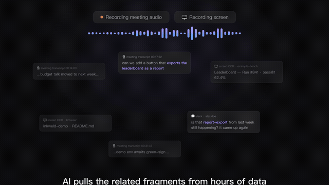
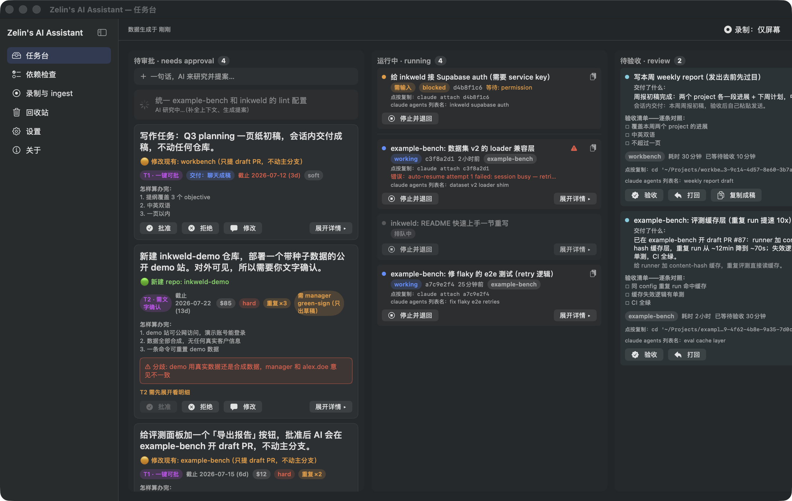
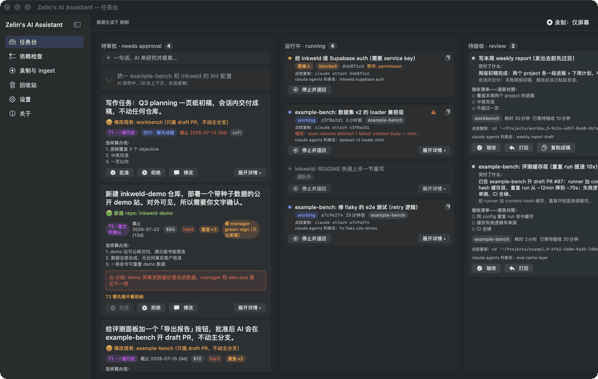
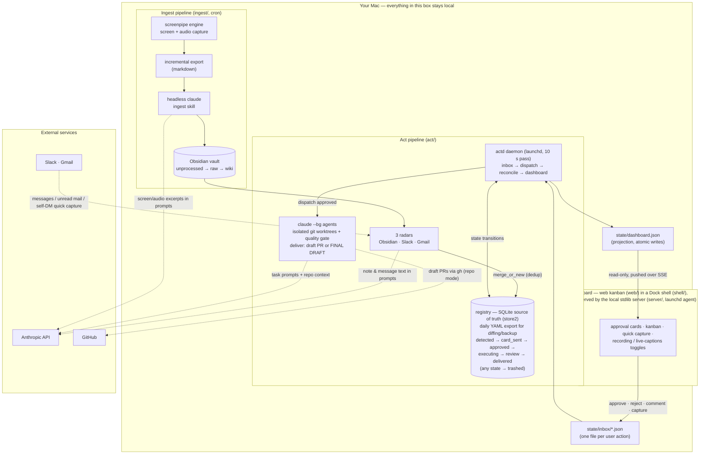

# Zelin's AI Assistant

**English** | [简体中文](README.zh-CN.md)

[](https://github.com/Wan-ZL/zelin-ai-assistant/actions/workflows/ci.yml)
[](https://github.com/Wan-ZL/zelin-ai-assistant/releases/latest)
[](LICENSE.md)
[](docs/INSTALL.md)
[](docs/INSTALL.md)

A personal AI chief-of-staff for macOS. It watches where work arrives (meeting notes, Slack, Gmail), turns requests into approval cards on a kanban board, and executes approved tasks with background Claude agents. You do two things — **approve** and **accept**. Everything else is automated.

<p align="center">
  <a href="docs/assets/promo-en.mp4"></a>
  <br><sub>▶️ <a href="docs/assets/promo-en.mp4">Watch the 60-second tour with sound</a> · <a href="docs/assets/promo-zh.mp4">中文版</a> — every frame is fictional demo data; the film rebuilds with one command from <a href="promo/">promo/</a></sub>
  <br><sub>Music: "Voxel Revolution" — Kevin MacLeod (<a href="https://incompetech.com">incompetech.com</a>), <a href="https://creativecommons.org/licenses/by/4.0/">CC BY 4.0</a></sub>
</p>



<p><br><sub>The life of one card: approve → queued → executing → review → accepted (<a href="docs/assets/demo.mp4">mp4 version</a>; all data shown is fictional, generated by <code>scripts/demo_seed.py</code>)</sub></p>

## How it works

- **Capture** — [screenpipe](https://github.com/mediar-ai/screenpipe) records screen + audio locally; scheduled jobs export increments and a headless Claude session distills them into an Obsidian wiki (`ingest/`).
- **Detect** — three radars (Obsidian notes, Slack, Gmail) scan for things people are asking you to do and file them into a requirement registry (SQLite source of truth with a daily, diffable YAML export) that merges duplicates across sources (`act/`).
- **Approve** — each requirement becomes a proposal card (plain-language summary, cost estimate, acceptance criteria) on the board — a web kanban served locally and shown in a plain Dock app. One click: ✅ approve, ❌ reject, 💬 comment.
- **Execute** — approved cards dispatch `claude --bg` agents in isolated git worktrees, supervised by a resident daemon (`actd`) with automatic resume and a quality gate (self-check, fresh-context diff review, draft-PR-only delivery).
- **Deliver** — finished work lands in a review lane: a paste-ready final draft for writing tasks, a draft PR for code. You accept it or send it back with comments.

The board and the pipeline are fully decoupled: the board reads the `state/dashboard.json` projection and writes your actions to `state/inbox/`; the `actd` daemon is the registry's only writer. That contract lives in [docs/CONTRACT.md](docs/CONTRACT.md).

### Architecture


```mermaid
flowchart TB
    subgraph MAC["Your Mac — everything in this box stays local"]
        direction TB

        subgraph INGEST["Ingest pipeline (ingest/, cron)"]
            SP["screenpipe engine<br/>screen + audio capture"] --> EXP["incremental export<br/>(markdown)"]
            EXP --> DISTILL["headless claude<br/>ingest skill"]
            DISTILL --> VAULT[("Obsidian vault<br/>unprocessed → raw → wiki")]
        end

        subgraph ACTP["Act pipeline (act/)"]
            RADARS["3 radars<br/>Obsidian · Slack · Gmail"]
            REG[("registry — SQLite source of truth (store2)<br/>daily YAML export for diffing/backup<br/>detected → card_sent → approved →<br/>executing → review → delivered<br/>(any state → trashed)")]
            ACTD["actd daemon (launchd, 10 s pass)<br/>inbox → dispatch → reconcile → dashboard"]
            AGENTS["claude --bg agents<br/>isolated git worktrees + quality gate<br/>deliver: draft PR or FINAL DRAFT"]
            RADARS -->|"merge_or_new (dedup)"| REG
            ACTD <-->|"state transitions"| REG
            ACTD -->|"dispatch approved"| AGENTS
        end

        VAULT --> RADARS

        DASH["state/dashboard.json<br/>(projection, atomic writes)"]
        INBOX["state/inbox/*.json<br/>(one file per user action)"]

        subgraph APP["Board — web kanban (web/) in a Dock shell (shell/),<br/>served by the local stdlib server (server/, launchd agent)"]
            UI["approval cards · kanban · quick capture ·<br/>recording / live-captions toggles"]
        end

        ACTD --> DASH
        DASH -->|"read-only, pushed over SSE"| UI
        UI -->|"approve · reject · comment · capture"| INBOX
        INBOX --> ACTD
    end

    subgraph EXT["External services"]
        ANTH["Anthropic API"]
        GH["GitHub"]
        SRC["Slack · Gmail"]
    end

    DISTILL -.->|"screen/audio excerpts in prompts"| ANTH
    RADARS -.->|"note & message text in prompts"| ANTH
    AGENTS -.->|"task prompts + repo context"| ANTH
    AGENTS -.->|"draft PRs via gh (repo mode)"| GH
    SRC -.->|"messages / unread mail / self-DM quick capture"| RADARS
```

Solid arrows are local file/process flow; dashed arrows are the only network egress (the full inventory, with the switches that control each one, is in [docs/PRIVACY.md](docs/PRIVACY.md)). The board never talks to the network: its server reads the projection and the registry read-only and writes your actions as inbox files — `actd` stays the registry's single writer (CONTRACT §44).

## Quickstart

```bash
git clone https://github.com/Wan-ZL/zelin-ai-assistant ~/Projects/zelin-ai-assistant
cd ~/Projects/zelin-ai-assistant
cp config.example.yaml config.yaml   # edit: Obsidian vault path, watched people, Slack IDs
bash install.sh                      # dependency checks → builds the app → launchd agents + cron chain
```

On first launch the app opens a bilingual **permissions & setup page**: one screen-recording consent (recording defaults to **screen-only** — audio is a separate opt-in in Settings), a live checklist for Screen Recording / Notifications / Full Disk Access, and a one-line anonymous-usage-stats disclosure (details & opt-out in Settings). Reopen it anytime via the app menu → Permissions Checkup. Then paste your Anthropic API key in the legacy app's Settings — or write it to `config/secrets/anthropic-api-key.txt` (mode `0600`) yourself; headless `claude` under cron/launchd cannot read Keychain OAuth, so the key lives in that file.

- Full walkthrough with per-step checkpoints, exact TCC permission paths, and a "first card in 5 minutes" exercise: **[docs/INSTALL.md](docs/INSTALL.md)** (also covers the `.pkg` installer route).
- No API key yet? One command previews the full board with fictional data: `bash scripts/dev-preview.sh` — see the section below and [docs/DEMO.md](docs/DEMO.md) (demo & recording guide).

## The board · two minutes to first look

The product UI is a browser kanban: a stdlib-only local HTTP + SSE server (`server/`) serving a React board (`web/`), wrapped in a thin Dock app (`shell/`) — no menu-bar icon. It is a client of the same file contract as everything else (reads `state/dashboard.json` + the registry, writes approvals to `state/inbox/`). The version you are running is whatever git tag `install.sh` stamped — the Release badge at the top of this page is the current one. Three ways in:

```bash
# ① Demo — fictional data, no API key, no install:
git clone https://github.com/Wan-ZL/zelin-ai-assistant && cd zelin-ai-assistant
bash scripts/dev-preview.sh              # builds web/ on first run, seeds demo data, opens your browser

# ② Real data — after `bash install.sh` has run once (or with AIASSISTANT_HOME set):
bash scripts/dev-preview.sh --real

# ③ Native window — "Zelin's AI Assistant (Board)": `bash install.sh` builds web/dist,
#    builds the thin shell and installs it to /Applications, and hosts the board
#    server as launchd agent com.zelin.aiassistant.server (CONTRACT §54). Dev loop:
bash shell/build.sh && open "shell/build/Zelin AI Board.app"   # connects to the running server
```

Building the web UI needs Node.js LTS — `dev-preview.sh` runs `npm install && npm run build` automatically when `web/dist` is missing; `install.sh` does the same (`npm ci` only when the lockfile changed) and skips the UI with a warning when node or swiftc is absent. The app shell is ad-hoc signed: building it yourself needs no Apple developer account; a copy downloaded from the internet needs a one-time right-click → Open (Gatekeeper).

## Requirements

| Component | Version | Used for |
|---|---|---|
| macOS | 14+ | board shell app, launchd/cron scheduling, TCC permissions |
| Xcode / Swift toolchain | 6.x | building the board shell (and the legacy app) from source |
| [Claude Code CLI](https://claude.com/claude-code) + Anthropic API key | latest | radars, proposal expansion, and execution all run on headless `claude` |
| Python | 3.9+ with PyYAML | `actd` daemon, radars, digest |
| Node.js | LTS (`npx`) | the screen-capture engine runs via `npx screenpipe`; building the web board (`web/`) |
| Obsidian *(optional)* | — | radar scan source and wiki destination |
| `gh` CLI *(optional)* | — | draft-PR delivery |

### Platform support

| OS | Status |
|---|---|
| macOS 14+ | **Full product** — web board in a Dock shell, launchd/cron scheduling, screen-capture ingest, Slack/Gmail radars |
| Linux | **Core is portable, port wanted** — the headless pipeline (radars, `actd`, executor) is pure Python and its full test suite runs green on ubuntu CI; service wiring (systemd units), an ingest chain, and a UI are unbuilt. Map + first milestone: [docs/PORTING.md](docs/PORTING.md) |
| Windows | **Core is portable, port wanted** — same story as Linux (minus CI coverage so far); Task Scheduler equivalents in [docs/PORTING.md](docs/PORTING.md) |

The Slack radar (incl. self-DM quick capture) is the cross-platform capture surface; approvals happen on the board.

## Features

- **Requirement radars with dedup** — restatements merge into the existing card instead of spamming you; genuine increments become linked "improvement" cards; low-confidence items park in a Backlog lane until raised.
- **Tiered approvals** — T0 auto / T1 one-click / T2 typed confirmation. Outbound messages, merges, and resource deletion are never automatic. Cost is shown above $5; above $50 the card escalates to T2.
- **Quality gate** — runnable check, read-only tests, fresh-context diff review, risk tiering, and revertible draft-PR delivery.
- **Two delivery modes** — `repo` (feature branch / draft PR) for code; `chat` (a paste-ready `FINAL DRAFT`) for writing tasks, so a one-paragraph reply never forces a git branch.
- **Voice profile for drafts** — anything written in your name follows a voice profile (short, plain, no boilerplate) instead of "polished assistant" register; a neutral starter template ships with the repo, and a private profile induced from your own messages overrides it ([docs/VOICE.md](docs/VOICE.md)).
- **Quick capture** — type a thought into the board's composer (one line → proposal, or run directly); an LLM triages it against the registry: new card, related to an existing one, or ignore. <!-- screenshot slot: docs/assets/t2-card.png -->
- **Responsive UI** — every click gives feedback within one frame (optimistic echo), kanban main window, recycle bin with inverse operations instead of a fake undo, bilingual UI (English / 中文). <!-- screenshot slot: docs/assets/review-final-draft.png -->
- **Mobile quick capture via Slack self-DM** — DM yourself a one-liner (or a photo/video of a whiteboard, screen, or sticky note) from your phone and it triages into a card, the same three-way gate as desktop capture ([docs/SLACK_SETUP.md](docs/SLACK_SETUP.md)). This is the mobile capture path until the iOS app ships; **approvals happen on the board** (the iMessage transport and Slack phone-approval were removed in v0.21).
- **Local-first content** — the registry, dashboard, and all captured content stay on your Mac; only anonymous usage events are uploaded by default (see Telemetry below).

## Telemetry

> **Anonymous usage statistics are ON by default** (like VS Code) and help drive product improvement. What's sent: event metadata only (event names, timestamps, a random device id, app version). **The text you type into the app** — captures, questions, rework feedback, search terms, each clipped to 500 chars — is **NOT uploaded by default**: `telemetry.capture_input` is off (opt-in) until you check "Share typed text to improve the product" on the first-run page, flip the Settings toggle, or set `telemetry.capture_input: true` yourself. **Never sent at any setting**: the AI's answers, screen-recording content, email or Slack/iMessage message bodies, file contents, or keys. Opt out in Settings → "Product improvement program": the typed-text toggle withdraws that consent (`telemetry.capture_input: false`), the master toggle stops everything (`telemetry.enabled: false`). Forks: telemetry points at the maintainer's Supabase project unless you change `telemetry.supabase_url` — setting it to `""` disables uploads entirely. Full field tables and details: [docs/TELEMETRY.md](docs/TELEMETRY.md).

## Privacy & security

This tool records your screen, can read your Slack/Gmail, and runs unattended agents — read what leaves your machine, when, and which switches control it in [docs/PRIVACY.md](docs/PRIVACY.md). Sensitive apps are excluded from screen capture at the engine level (`recording.ignored_apps` in config.yaml — password managers, Keychain Access, and private-browsing windows by default; add your banking apps there). Report vulnerabilities privately via [SECURITY.md](SECURITY.md).

## Status

- [x] v0: approval card → ✅ → executed task, end to end
- [x] v1: three radars on cron/launchd, approval round-trip, Monday digest
- [x] v2: SwiftUI menu-bar app (kanban window + quick capture + recycle bin + bilingual) — frozen: the board took over its job; it stays installed until the owner retires it
- [x] Architecture baseline (the current major — see the Release badge above): SQLite source of truth, web board in a Dock shell with recording/captions toggles, merge = release = deploy, quality gates as merge gates, versions minted from git tags. Plain-language notes: [CHANGELOG.md](CHANGELOG.md) `[Unreleased]`; the plan and acceptance checklist: [docs/design/vnext2-plan.md](docs/design/vnext2-plan.md)
- [ ] v3: iOS remote approver (`ios/` is a placeholder)

What's in flight and what comes next: [docs/ROADMAP.md](docs/ROADMAP.md).

## Contributing

You don't need the full stack to hack on this: the test suite runs in under a second with just Python + PyYAML, and `scripts/demo_seed.py` drives the complete UI with fictional data — no API key, screenpipe, or Obsidian required. Start with [CONTRIBUTING.md](CONTRIBUTING.md); the [CODE_OF_CONDUCT.md](CODE_OF_CONDUCT.md) applies everywhere.

Questions → [Discussions (Q&A)](https://github.com/Wan-ZL/zelin-ai-assistant/discussions) · bugs → [issue forms](https://github.com/Wan-ZL/zelin-ai-assistant/issues/new/choose).

## License

Released under the [Functional Source License 1.1, MIT Future License (FSL-1.1-MIT)](LICENSE.md). In plain English:

- **You can** use, fork, modify, and redistribute it — including commercial use inside your company.
- **You can't** sell a product or service that competes with this software.
- **Future open source**: each release automatically converts to the MIT License 2 years after it ships.
- **Contributions** are welcome — issues, suggestions, and PRs alike; see [CONTRIBUTING.md](CONTRIBUTING.md). (GitHub shows the license as "Other" because FSL isn't in its detector; the badge above is authoritative.)

More questions — use at work, forks, what counts as competing use, per-release MIT conversion dates — are answered in plain language in [docs/LICENSE-FAQ.md](docs/LICENSE-FAQ.md).

## Documentation

| Doc | What's inside |
|---|---|
| [docs/INSTALL.md](docs/INSTALL.md) | the authoritative install guide: prerequisites, per-step checkpoints, TCC paths, first card in 5 minutes |
| [HANDOFF.md](HANDOFF.md) | **the handoff book, written by the AI assistant that built this system**: architecture map, the reasoning behind every "weird" design decision, and a pitfall list paid for in real debugging time |
| [docs/CONTRACT.md](docs/CONTRACT.md) | the `dashboard.json` / inbox data contract — change fields here first |
| [docs/TROUBLESHOOTING.md](docs/TROUBLESHOOTING.md) | symptom-first fixes for the known failure modes |
| [docs/DEMO.md](docs/DEMO.md) | demo mode (fictional data, no keys needed) and recording guide |
| [docs/PRIVACY.md](docs/PRIVACY.md) / [SECURITY.md](SECURITY.md) | data egress inventory / vulnerability reporting |
| [docs/ROADMAP.md](docs/ROADMAP.md) | what's in progress, next, and later |
| [docs/PORTING.md](docs/PORTING.md) | Windows/Linux porting map: what's portable today, the OS seam, service-manager equivalents, first milestone |
| [CHANGELOG.md](CHANGELOG.md) | human-readable release history |
| [CONTRIBUTING.md](CONTRIBUTING.md) / [CODE_OF_CONDUCT.md](CODE_OF_CONDUCT.md) | how to contribute / community standards |
| [docs/LICENSE-FAQ.md](docs/LICENSE-FAQ.md) | FSL-1.1-MIT in practice: company use, competing use, the 2-year MIT conversion |
| [docs/SLACK_SETUP.md](docs/SLACK_SETUP.md) / [docs/GMAIL_SETUP.md](docs/GMAIL_SETUP.md) | optional source integrations |
| [docs/SANITIZATION.md](docs/SANITIZATION.md) | provenance: how this public export was sanitized from the private repo |

Design docs ([docs/design/](docs/design/README.md)) record intent and owner decisions — lane semantics, the v-next-2 plan and its acceptance checklist; the behavior contract itself stays in [docs/CONTRACT.md](docs/CONTRACT.md).

### Repository layout

```
ingest/            # screenpipe → Obsidian chain (export / process / cleanup + skill)
act/
  actd.py          # daemon: inbox → dispatch → reconcile → dashboard
  executor.py      # claude --bg dispatch + resume/rework + quality gate + delivery harvest
  radar*.py        # three requirement radars (Obsidian / Slack / Gmail)
  analyze.py       # debt → approvable proposal expansion (LLM)
  digest.py        # state digest (digest.frequency, default off) + self-improvement suggestion cards
  lib/             # config / registry (state machine) / dashboard projection / notify / secrets / …
  registry/        # requirement ledger (one YAML per requirement, generated at runtime)
  launchd/         # actd + radar plists
mac/               # SwiftUI menu-bar app (reads dashboard.json, writes inbox, never touches secrets)
ios/               # v3: remote approver (placeholder)
```

## Contributors

Thanks to everyone who has contributed — every issue, suggestion, and PR
makes this project better:

[](https://github.com/Wan-ZL/zelin-ai-assistant/graphs/contributors)

Want to join them? Start with a
[good first issue](https://github.com/Wan-ZL/zelin-ai-assistant/issues?q=is%3Aissue+is%3Aopen+label%3A%22good+first+issue%22)
and see [CONTRIBUTING.md](CONTRIBUTING.md).

Copyright (c) 2026 Zelin Wan (https://github.com/Wan-ZL)
