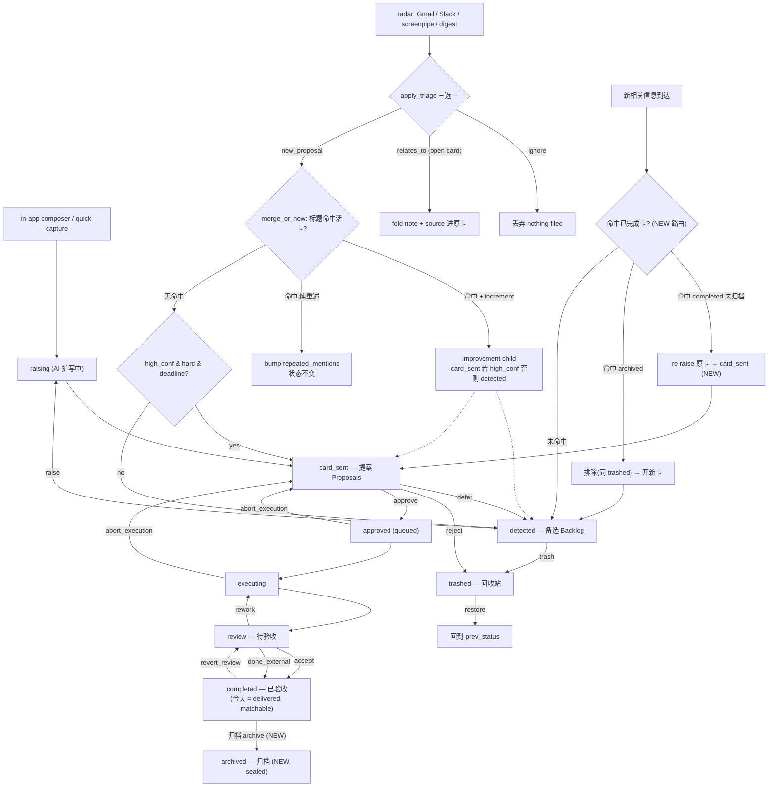
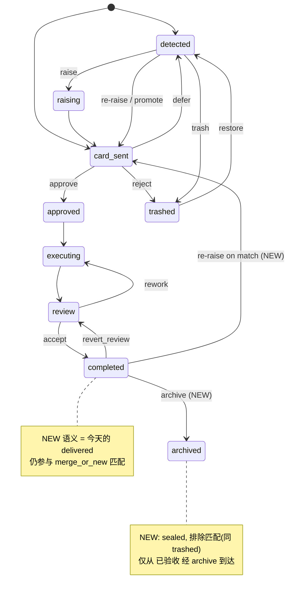

# Card 生命周期 + 归档/重提（archive & re-raise）设计

> **Status: DRAFT for Zelin's review, 2026-07-11**
> 这份文档记录的是 PM-level 的产品意图（lane 语义、re-raise 规则、archive 概念），
> 以及为什么现在会出现「已验收的事又冒出一张新 backlog 卡」。所有对**当前行为**的
> 陈述都 ground 在 `file:line`，方便你逐条核对；带 **(NEW)** 标记的是**尚未实现**的
> 提案（future feature → minor release），不是现状。

---

## 1. Problem statement — 已验收的事不该再生一张重复卡

真实例子：一个 EB-1A / immigration-counsel 的事项，之前作为 **R-010** 已经走完流程、
被你 accept 成 `delivered`（UI 里的 **已验收** lane）。后来 counsel 发来 revised
recommendation letter 需要 review，系统没有把 **R-010 重新抬起来（re-raise）**，而是在
**备选 / Backlog** lane 里新生成了一张独立的卡。

产品意图（你的原话口径）：**prior acceptance = ownership**。一件你已经验收（拍过板、
认领过）的事，后续相关信息来了，应该把**原来那件事重新抬回你的「提案 / 待办」视野**
（re-raise），而不是当成一件全新的、AI 猜出来的 backlog suggestion。只有当你显式把它
**归档（archive, NEW）** 封存之后，后续信息才允许开一张全新的卡。

这份文档要回答两件事：
1. **为什么现在会跑出新 backlog 卡**（root cause，见 §3 + §5 的 matching 讨论）；
2. **该怎么补** completed(matchable) vs archived(sealed) 的区分 + re-raise 路由（见 §4/§6）。

---

## 2. Canonical lane semantics（lane 的权威定义 — 产品意图）

这一节是**你对 lane 的定义**（product intent），不是全部现状。逐条标了哪些**已匹配
当前代码**、哪些是 **(NEW)**：

### 提案 / Proposals（`card_sent` 状态，dashboard 的 `needs_approval` 区）
= **"mine / must-do"**，我认领的、必须处理的。来源有三：
- **(a) 用户主动经 composer 发起** — ✅ 当前已匹配。in-app quick capture 走
  `capture → detected → raising → card_sent`（`act/actd.py:209-244`），最终落在
  `card_sent`（提案）。
- **(b) AI 判定 must-handle** — ✅ 部分匹配。radar 里 `high_confidence & hardness=="hard"
  & deadline` 才直接进 `card_sent`，否则落 `detected`（`act/lib/registry.py:568-572`）；
  低置信度被显式压回 `detected`（`act/lib/quick_capture.py:432-437`）。
- **(c) 从 completed 项 re-raise 回来（prior acceptance = ownership）** —
  ⚠️ **只部分匹配**。当 radar 的 triage LLM 明确判定新信息 `relates_to` 一个已 resolved
  的卡且 `needs_action=true` 时，`_follow_up_card` 确实会新建一张 **`card_sent`** 的
  follow-up（`act/lib/quick_capture.py:310-339`，status 硬编码 `CARD_SENT` at :330，
  带 `improvement_of` lineage）。**但**这依赖 LLM 认出关联；一旦走成 `new_proposal`
  且标题没近似匹配上，就掉进 §3 的坑，落到 **备选**。这条 lane 语义里的
  "re-raise 一定进提案" 目前**没有一个统一强制的路由**。

### 备选 / Backlog（`detected` 状态，dashboard 的 `debt` 区）
= **"AI's suggestions extracted from info streams (Gmail / Slack / screenpipe)"**，may-do。
- ✅ 当前已匹配。`detected` → `debt` lane（`act/lib/dashboard.py:362-372`）。这是 AI 从
  信息流里扒出来、置信度不够高 / 不够紧急的候选，等你「研究并提议」(`raise`) 或直接删。

> 一句话对账：**(a) 已实现、(b) 大体实现、(c) 只在 LLM 认出关联时实现**。缺的正是
> "completed 项被后续信息命中时，无条件 re-raise 进提案" 这条统一规则 —— 这也是
> Problem statement 的病灶。

---

## 3. 当前状态机与 root-cause（VERIFIED ground truth）

### 3.1 State enum（`act/lib/registry.py:25-43`）
线性主链（CONTRACT §1）：
```
detected → card_sent → approved → executing → review → delivered
```
外加 `raising`（debt 被 AI 扩写中）、`rejected`、`trashed`、`merged`（merge-review 终态）。

> **注意：当前 enum 里没有 `completed`，也没有 `archived`。**
> UI 里的「**已验收**」lane = `delivered` 状态（`act/lib/dashboard.py:451-468`，
> `accept` 动作把 `review → delivered`，`act/actd.py:570-577`）。
> 本文档说的 `completed`(已验收，matchable) 语义 = **今天的 `delivered`**；
> `archived`(归档，sealed) 是全新的第二个「完成态」。

### 3.2 状态 → lane 映射（`act/lib/dashboard.py`）
| 状态 | lane | 行号 |
|---|---|---|
| `card_sent` | 提案 / needs_approval | :312-341 |
| `raising` | 提案（灰色 spinner 占位） | :343-360 |
| `detected` | 备选 / debt | :362-372 |
| `trashed` | trash（回收站） | :374-387 |
| `approved` | running（queued） | :389-408 |
| `executing`/`review`/`delivered` | running / needs_input / **review(待验收)** / **completed(已验收)** | :410-537（delivered→completed :451-468；review→review :469-501） |
| `merged` / legacy `merged_into:<id>` / `rejected` | **不可见**（`continue`） | :308-310 |

### 3.3 lane 是怎么决定的：radar vs composer
- **radar 项**（Gmail/Slack/screenpipe/digest）：先过 `quick_capture.apply_triage`
  三选一（`act/lib/quick_capture.py:342-440`）——`ignore` / `relates_to` / `new_proposal`。
  真正决定 `card_sent` 还是 `detected` 的是：
  - `merge_or_new` 的 brand-new 分支：`high_confidence and hardness=="hard" and deadline`
    → `card_sent`，否则 `detected`（`act/lib/registry.py:568-572`）；
  - `confidence=="low"` 强制压回 `detected`（`act/lib/quick_capture.py:432-437`）；
  - 折进一张 `detected` 卡且 `needs_action` → 升 `card_sent`（`:417-424`）。
  > 备注：任务里给的 `dashboard.py:~306/318` 其实是 lane 渲染分支，不是 routing 决策；
  > 真正的 hardness/deadline/urgent 路由在 `registry.py:568-572` + `quick_capture.py`。
- **in-app composer**（quick capture）：`capture → detected →（若仍 detected）raising →
  process_raising 扩写 → card_sent`（`act/actd.py:209-244`）——用户主动发起的一律奔向
  **提案**，不停在备选。

### 3.4 ★ CRITICAL：`delivered`（已验收）**参与** `merge_or_new` 匹配吗？—— 参与

**答案：参与（PARTICIPATES），不像 `trashed` 那样被排除。** 这是 root-cause 的核心。

`merge_or_new` 的排除名单只有三种（`act/lib/registry.py:535`）：
```python
if r.is_merged or r.status in (State.REJECTED.value, State.TRASHED.value):
    continue
```
- `is_merged` = legacy `merged_into:<id>` 字符串状态（`registry.py:159-161`）；
- `rejected`、`trashed`。

**`delivered` 不在排除名单里** → 它是**活的匹配候选**。代码注释也写死了这点：
`State.MERGED`「匹配语义同 `delivered` —— 参与匹配以压住后续重述」
（`registry.py:40-43` 与 :530-534；`RESOLVED_STATES=(DELIVERED, MERGED)` at :363）。

**那为什么还会冒出新 backlog 卡？** 因为「参与匹配 ≠ re-raise」，有三个坑：

1. **匹配是 title-based。** `_same_source_and_title`（`registry.py:454-470`，被 :537
   调用）只在**标题近似**时才命中：normalize 后完全相等，或包含关系且较短一方
   `len >= 12`。EB-1A 那件事，"review revised recommendation letter" 跟 R-010 原标题
   大概率**对不上** → 不命中 → 走 brand-new。
2. **brand-new 默认落 `detected`。** 不命中 → 新卡，且非 `high_conf+hard+deadline`
   → `detected`（**备选**）（`registry.py:566-572`）。**这就是那张新冒出来的备选卡。**
3. **即便命中 delivered 父卡，也不是把父卡抬回提案。** 命中且 `_carries_increment`
   → 新建一张 **improvement child**，status = `card_sent` 仅当 `high_confidence`，
   否则 `detected`（`registry.py:542-558`）。digest / weekly_digest 都传
   `high_confidence=False`（`act/digest.py:187`、`act/weekly_digest.py:247/293`）
   → child 落 **备选**。纯重述（无 increment）则只 bump `repeated_mentions`、状态不变
   （`registry.py:559-564`）。

> **Root-cause 一句话**：`delivered` 今天**确实参与 `merge_or_new` 匹配**，但
> (i) 匹配是标题近似，标题一变就不命中；(ii) 命中也只会生 improvement child /
> bump，**从不把原卡抬回 `card_sent`(提案)**；(iii) 低置信路径一律落 `detected`。
> 三者叠加，一件已验收的事被后续信息命中时，最常见的结局是**在备选里多一张卡**，
> 而不是原事项被 re-raise 进提案。radar 的 `relates_to → _follow_up_card` 那条路
> 本来会进 `card_sent`（`quick_capture.py:330`），但只在 LLM 认出关联时才走得到。

---

## 4. 提议的新状态 / 新流程 (NEW — 未实现)

把今天「一个 `delivered` 既是完成又永远可匹配」拆成**两个完成态**：

- **`completed`（已验收，matchable）(NEW 语义 = 今天的 `delivered`)**
  = 事做完了、你验收过，**但仍参与匹配**。后续相关信息命中它 → **把原事项 re-raise
  进「提案 / `card_sent`」**（不是生备选卡）。**即使新触发很小（minor），prior-accept
  也压过 urgency-based routing** —— 因为你认领过，它就是 must-do。
- **`archived`（归档，sealed）(NEW)**
  = 事做完了 **且封存**，语义同回收站的「不参与匹配」（但不是删除，可查阅）：后续相关
  信息 **不再命中它**，会正常开一张全新卡。`archived` 从 **已验收** 经一个新的
  **归档** 动作到达。

**Re-raise 路由规则（NEW）**：
```
new info 命中 completed(未归档)   → re-raise 原卡 → card_sent（提案）
new info 命中 archived            → 排除（同 trashed）→ 走 new_proposal 开新卡
```

> 对照现状：`completed` 的「参与匹配」今天已经是 `delivered` 的行为（§3.4），
> **缺的是 re-raise 路由**（命中就无条件抬回提案）和 **archived 这个可封存的出口**。

---

## 5. Matching granularity 讨论 —— thread-level vs task-level（诚实版）

re-raise 好不好用，**完全取决于 matcher 质量**，这点必须说实话。

- **thread-level 匹配**（同一封邮件线程 / 同一 counsel 往来算一件事）：召回高，
  但会把「同 thread、不同 task」的东西也抬起来。EB-1A 那两张卡**很可能就是
  same-thread-but-different-task**——原 R-010 是一件已验收的交付，revised-letter
  review 是**同一线程里的一件新任务**。thread-level 会正确地把它们关联，但也可能
  把不该合并的后续都塞进老卡。
- **task-level 匹配**（按具体任务/deliverable 区分）：精度高，但今天的 title-based
  `_same_source_and_title`（`registry.py:454-470`）粒度太粗，标题一改就 miss，
  正是 §3.4 的坑。

**推荐**：把**未归档的 `completed` 纳入匹配候选**（现状 `delivered` 已如此，
只需在拆出 `completed`/`archived` 后保持），re-raise 命中即抬回提案；**但**要清醒
——re-raise 的有效性 = matcher 的召回/精度。短期靠现有 title + source 启发式 +
radar 的 `relates_to` LLM 判定（`quick_capture.py:380-426`）兜底；中期若要真正解决
same-thread-different-task，需要更强的语义/线程级匹配信号（thread id、参与人、
时间窗），这属于 matcher 单独的工作项，不在本设计的最小实现内。

---

## 6. Mermaid 流程图

### 6.1 全生命周期（含 re-raise / 归档 / trash） — 提案命名

> 用**提议后**的命名（`completed`/`archived`）。**(NEW)** = 未实现。



### 6.2 状态图（提议的完成态分叉）



---

## 7. Implementation notes（FUTURE feature，未实现）

grounded 在 §3 的现状。这些都是**新功能 → minor release**，现在**没做**：

1. **新增 `archived` 状态** — `State` enum 加 `ARCHIVED = "archived"`（`registry.py:25-43`）。
   决定 `completed` 是保留 `delivered` 名字还是改名（改名要迁移旧 YAML + Swift 解码，
   成本高；建议**保留 `delivered` 作为「已验收/matchable」，只新增 `archived`**）。
2. **新增 `archive` inbox 动作** — `_apply_decision` 加一支 `elif action == "archive"`
   （`act/actd.py:516-682`，紧挨 `revert_review` :653-664）：仅允许 `delivered` →
   `archived`（其余状态幂等 no-op，遵 v0.10.2 公共规则）；同步进 CONTRACT §10 动作全集
   （`docs/CONTRACT.md:126-137`）。**今天没有 `archive` 动作**——未知动作走 :681-682 的
   no-op else。
3. **`merge_or_new` 把「未归档 completed」纳入匹配** — 现状 `delivered` 已参与
   （`registry.py:535` 不排除它），只需在排除名单里**加上 `archived`**（同 `trashed`）：
   ```python
   if r.is_merged or r.status in (REJECTED, TRASHED, ARCHIVED):  # NEW: + ARCHIVED
       continue
   ```
4. **re-raise 路由：命中 completed → 抬回 `card_sent` + lineage** — 命中一个
   `completed`(未归档) 父卡时，不再走「improvement child 落 detected」
   （`registry.py:542-558`）或纯 bump，而是把**原卡** `set_status(CARD_SENT)`
   （提案），并记 lineage（复用 `improvement_of` / notes 标注来源）。这条要
   **压过** `high_confidence`/urgency 路由（prior-accept overrides）。radar 侧
   `_follow_up_card` 已经是 `card_sent`（`quick_capture.py:330`），可作为一致性参考。
5. **dashboard / Swift 露出「归档」视图** — dashboard 加一个 `archived` 分区
   （类似 `trash` :374-387 的处理），Swift 端加一个默认折叠的「归档」区 +「归档」按钮
   （已验收行）与可能的「取消归档」。config 层无需新增（archived 不做 retention purge）。

---

## 8. Open questions for Zelin

1. **Thread-vs-task 粒度**：EB-1A 那两张卡若确是 same-thread-different-task，你希望
   revised-letter review **合并进 R-010 re-raise**，还是**作为 R-010 的独立 follow-up
   卡（带 lineage）** 出现在提案？（前者 thread-level，后者 task-level。）
2. **archive 的可达性**：`archived` 是否**只能从「已验收(`delivered`)」到达**？还是也
   允许从 `card_sent`/`detected` 直接归档（「这事我不做了但也别删」）？现状里
   `defer`(→备选) 和 `trash`(→回收站) 已覆盖后两种意图，archive 是否应保持**只封存
   已完成的事**？
3. **re-raise 一定进提案吗**：re-raise 是否永远进 **提案(`card_sent`)**，还是某些情况
   （比如新触发极弱 / 低置信）应该进 **备选(`detected`)** 让你自己决定要不要抬？
   §4 的产品意图是「prior-accept 压过 urgency，一律进提案」，但这会不会让提案 lane
   在高频邮件线程下变吵？
