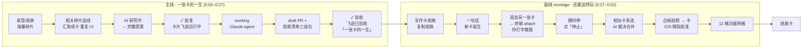

# Promo video — style notes & storyboard

≤60 秒宣传片（v6 成片 56.0s），**中英各一版**（`?lang=en` 渲染英文看板——UI
chrome 用 app 源码里真实的 `L()` 英文文案，卡片内容是同一套虚构数据的英文版，
见 `stage/i18n.js`）。所有画面数据来自 `scripts/demo_seed.py` 的虚构 scene
（example-bench / inkweld / alex.doe / sam.rivera，零真实信息）。重录一条命令：
`bash promo/make.sh`（详见 [README](README.md)）。

## 故事脉络（改分镜前先改这里）

**铁律：主角卡 R-101 的一生一镜不断；其余功能全部放到主线完结之后的 montage，
不打断叙事。**（v4 教训：验收前插周报特写、运行时插 merge，观众会跟丢主角卡。）

主线内不换主体；副线每拍换一个主体但用字幕明确"这是另一个能力"；副线的终端
场景 attach 的是另一张 working 卡（R-105 flaky 测试），标题、agent 名、session
id 三处一致，不与主角混淆。

## 参考风格拆解（style notes）

参考：Photon iMessage App API 发布视频（42s，Apple keynote 式极简）。结构：

| 段落 | 手法 |
|---|---|
| 0–3s 标题卡 | 净色背景 + 特粗标题，行内嵌彩色 app 图标，词级入场动画 |
| 3–30s 用例演示 | 设备框内真 UI 走流程；一段一个用例；镜头推近关键操作；转场全部硬切 |
| ~33s 广度展示 | 文字轮播（"your agent can send [icon] games / …"）+ 用例卡片网格拉远 montage |
| 39–42s 收尾 | logo 定格，无 CTA 之外的杂物 |

借鉴要点：**硬切卡在节奏点**、一段只讲一件事、字幕短句、演示画面永远在动
（打字、光标、滚动）、结尾只留 logo + 一行信息。

本片改编：设备框换成 macOS 深色窗口（app 本来就是 dark kanban）；标题/结尾卡
用同款深色 + App 图标；广度段用 12 格功能网格拉远替代文字轮播。

对照参考片补齐的四个手法（v2）：

1. **一屏一件事**：hero 聚焦镜头里非主角卡整体压暗降饱和（`.pane.focus`），
   参考片"大量留白、单一主体"的等价物——在信息密度高的看板上用亮度分层实现。
2. **文字有自己的空间**：字幕加大 + 底部渐变 scrim，不再和卡片文字打架。
3. **切点带视觉冲击**：每个硬切落拍瞬间镜头 3% punch-in 再回弹（0.4s），
   音乐重音和画面冲击同时发生。
4. **物理连续性**：批准/验收两个时刻，hero 卡化作紧凑幽灵卡从原列飞进目标列
   （`.flyghost`），代替瞬移——参考片里 mail 卡"发送入流"的等价物。

## 配乐

"Voxel Revolution" — Kevin MacLeod (incompetech.com)，CC BY 4.0。
`promo/beatgrid.py` 实测：81.25 BPM 网格（与 121.75 呈 3:2，breakbeat 双解），
强拍每 **1.4769s**，首拍 offset **0.255s**。所有镜头切换都落在
`0.255 + n × 1.4769s`（每个强拍）上；见 `stage/timeline.js`。
注意提速不要用 ffmpeg setpts 后期加速——那会让切点脱离节拍网格；
正确做法是改 `timeline.js` 里的 cue（本片即按 1.25x 紧凑度重排）。

发布时注明（CC BY 要求）：
`Music: "Voxel Revolution" Kevin MacLeod (incompetech.com), CC BY 4.0`

## 分镜 v6（timecode 以成片为准）

**主线 · 一张卡的一生（主体永远是 R-101，一镜不断）**

| # | 时间 | scene 数据 | 画面 | 字幕（CN） |
|---|---|---|---|---|
| M0 | 0:00–0:03.2 | — | 深色标题卡：App 图标弹入 + "Zelin's AI Assistant" + 双语副标题 | — |
| M1 | 0:03.2–0:10.6 | 提取 overlay | 「会议录音中/录屏中」徽章 + 波形 → 6 块碎片飘入（转写×3、屏幕 OCR×2、slack×1）→ 无关碎片退暗、相关碎片点亮关键词 → 紫线连接 → 汇聚成一张卡（meeting/slack chips + 重复×2）→ 切入看板「AI 研究中」占位卡 | 录音、录屏，全在本地 → AI 从海量数据里找出相关碎片 → 不同渠道催同一件事，只出一张卡 |
| M2 | 0:10.6–0:15.0 | `initial` | 占位卡绽放成完整提案：计划/验收标准级联，chips（T1/截止/$12/重复×2）逐拍脉冲；光标滑向「✓ 批准」 | 自动变成提案：计划、验收标准、成本 |
| M3 | 0:15.0–0:19.5 | `approved`→`running` | 点击批准 → 幽灵卡飞进运行中（排队中 1.5s）→ 变 working（同名同 glow） | 一键批准，后台 Claude agent 开工 |
| M4 | 0:19.5–0:23.9 | `review` | 硬切待验收：同一张卡，draft PR #42 回执 + 验收清单三连勾 | 交付 draft PR + 验收清单，不碰 main |
| M5 | 0:23.9–0:26.8 | `done` | 硬切全景 + 幽灵卡从待验收飞进已验收，定格 | 验收归档——一张卡的一生 |

**副线 montage · 还能这样玩（每拍一个能力，快切卡点）**

| # | 时间 | 画面 | 字幕（CN） |
|---|---|---|---|
| E1 | 0:26.8–0:29.8 | 镜头潜入 weekly report 卡：成稿块展开（双语周报全文），光标点「复制成稿」→ 已复制 ✓ | 写作任务出成稿，用你的语气 |
| E2 | 0:29.8–0:32.7 | 镜头上移到输入框：打字「统一 example-bench 和 inkweld 的 lint 配置」→ Enter → 灰色研究卡弹出 | 或者，一句话扔给它 |
| E3 | 0:32.7–0:37.2 | 硬切运行中列另一张 working 卡（flaky 测试）：双击复制行 → ghostty 终端弹出，`claude attach a7c9e2f4` 打字 → agent 日志 → **你打一行字**「bump the retry cap to 5」→ agent 改完 40/40 green | 双击进 live session，像平时一样接着聊 |
| E4 | 0:37.2–0:38.7 | 终端收起，光标直接点这张卡的「停止」→ 涟漪 | 随时停、随时打回——每张卡都在你手里 |
| E5 | 0:38.7–0:43.1 | merge vignette：主卡/副卡多选打勾 → 紫色 AI 裁决卡 → 接受 → 副卡飞入主卡 | 重复的卡？AI 裁决怎么合 |
| E6 | 0:43.1–0:47.5 | iPhone 框：Slack 给自己发白板照片 → 「AI 研究中」卡 → 切 iOS 看板拇指批准（E2E 加密底注） | 白板拍一张就是卡片，iOS 直接批准 |
| E7 | 0:47.5–0:52.0 | 12 格功能网格拉远 | local-first，数据留在你的 Mac |
| E8 | 0:52.0–0:56.0 | 结尾卡：图标 + repo 徽章 + 平台/license，音乐淡出渐黑 | — |

8 个批准功能的落位：跨渠道合并→M1｜透明决策 chips→M2｜聊天成稿+voice→E1｜
快速捕获→E2｜双击微操+对话→E3｜停止/打回控制→E4｜AI merge-review→E5｜
手机闭环→E6｜auto-resume→grid tile（E3 画面里 R-107 也带真实 auto-resume 行）。

## 改版指南

- 改文案/时长/镜头：只动 `stage/timeline.js`（所有 cue 集中在此）。
- 换配乐：`promo/beatgrid.py <track>` 重测 BPM/offset，更新 `PULSE`/`OFFSET`。
- 卡片内容变了：什么都不用做——stage 直接吃 `demo_seed.py` 的输出。
- UI 改版了：对照 `docs/assets/kanban.png` 更新 `stage/stage.css` 的还原样式。
